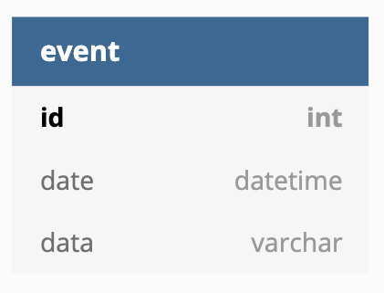

# Usage :

-> Create a virtual env : python3 -m venv [name of your vitual env]  
-> Go to your virtual env : source [name of your virtual env]/bin/activate  
-> Run your program : python3 main.py  

# Database Structure :

